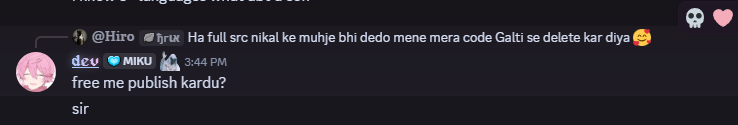
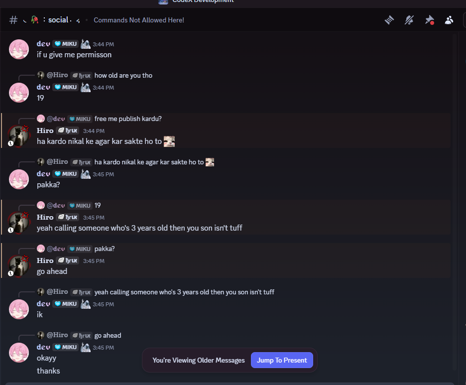
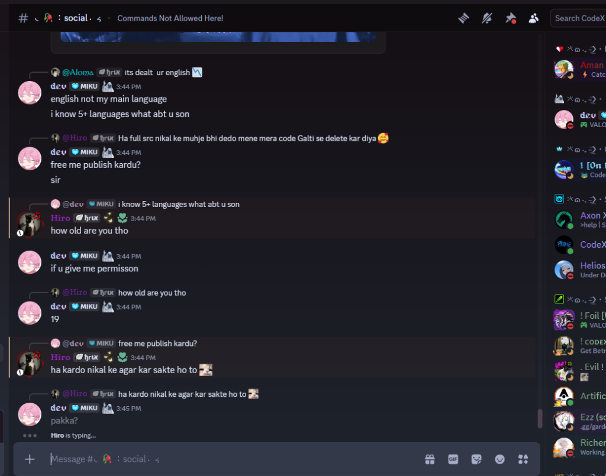

# AniRock (Open Source Release)

🔴 **Live Demo:** [https://anirock.netlify.app/](https://anirock.netlify.app/)

## 📖 The Story Behind This Release

This codebase was originally sold by a developer named **Hiro** for **$8.50**. However, after recent events and discussions, we have decided to release this "source code" for **FREE** for everyone to use.

### Why?
The creator, Hiro, came to our server accusing us of "skidding" (copying code). We apologized and clarified that we don't want to fight. After a conversation, **Hiro literally gave us permission to publish this**.

He claimed: *"Ha kardo nikal ke agar kar sakte ho to"* (Go ahead and publish it if you can reverse/extract it).

So, here we are. We've de-obfuscated parts of it, rebranded it to **AniRock**, and are making it public so no one else has to pay for what is essentially a bundled React app wrapper around a public API.





---

## 🤡 A Note for the "Critics"

To the guy  who mocked me saying *"Who pays 4k INR for code like this?"*—listen up.

**I don't build "atu jhatu" (trash) code like this.** 

This repository is literally a **dump of a bundled, obfuscated app** that someone else was selling. I am releasing it for **FREE** solely to prevent people from getting scammed by paying $8.50 for it. 

**Do not confuse this spaghetti bundle with my actual work.**
My professional projects (Scalable Custom Backends, optimized React setups) are worth far more than 4k INR. I don't use public APIs for my main projects; I build custom backends. 

If you want trash, take this for free. If you want quality, you pay for quality. 🤫

---

## 🏗️ Architecture & Technical Docs

We have documented the internal workings of this bundled app for developers who want to understand or modify it.

*   📖 **[ARCHITECTURE.md](./ARCHITECTURE.md)** - Detailed breakdown of the app's structure, components, and state management.
*   📡 **[DATA_FETCHING.md](./DATA_FETCHING.md)** - Deep dive into how the app fetches data from the Vercel API, including endpoints and response structures.

---

## 🧩 Architecture Summary


## 🏗️ Architecture & How It Works

This project is a **React Single Page Application (SPA)** that has been heavily bundled. It's not a clear "source code" in the traditional sense (clean components), but rather a web-packed bundle that rendered the site.

### Key Components:
- **Frontend Framework:** React 18 (bundled).
- **Styling:** TailwindCSS (utility classes mostly found in the bundle).
- **Routing:** React Router (handling routes like `/watch/:id`, `/home`, etc.).
- **Bundler:** Vite (inferred from structure).

### ⚙️ Data Fetching (The "Secret" Sauce)

The app doesn't have a complex backend. It simply fetches data from a public API endpoint.

**Primary API Endpoint:**
`https://apii-orcin-theta.vercel.app/api`

**How it fetches data:**
1.  **Home Page:** Calls `/home` (or similar index routes) to get Trending, Top Airing, and Latest episodes.
2.  **Streaming:**
    *   It fetches episode sources from endpoints like `/stream?id=...`.
    *   It uses proxies (e.g., `m3u8-proxy`) to bypass CORS or geoblocking for the video streams.
3.  **Search:** Queries the `/search` endpoint.

### 🐛 "Spaghetti Code" Warning
Since this was originally a production bundle that we've partly reversed/patched:
*   Most logic lives in `src/bundle.js`.
*   Variable names are minified (e.g., `f6`, `x.jsx`).
*   We have patched the **Logo**, **Site Name**, and **Footer** manually in this bundle.

## 🚀 How to Run

1.  **Install Dependencies:**
    ```bash
    npm install
    ```
2.  **Start Development Server:**
    ```bash
    npm run dev
    ```
3.  **Build:**
    ```bash
    npm run build
    ```

## 📝 Credits & Rights

*   **Original "Creator":** Hiro (who sold this).
*   **Published for Free by:** [CODEX DEV] - Because paying for this is unnecessary.
*   **License:** Free for everyone. Do whatever you want with it. Skids welcome.

---
*Disclaimer: We do not host any content. This app just acts as a browser for third-party APIs.*
